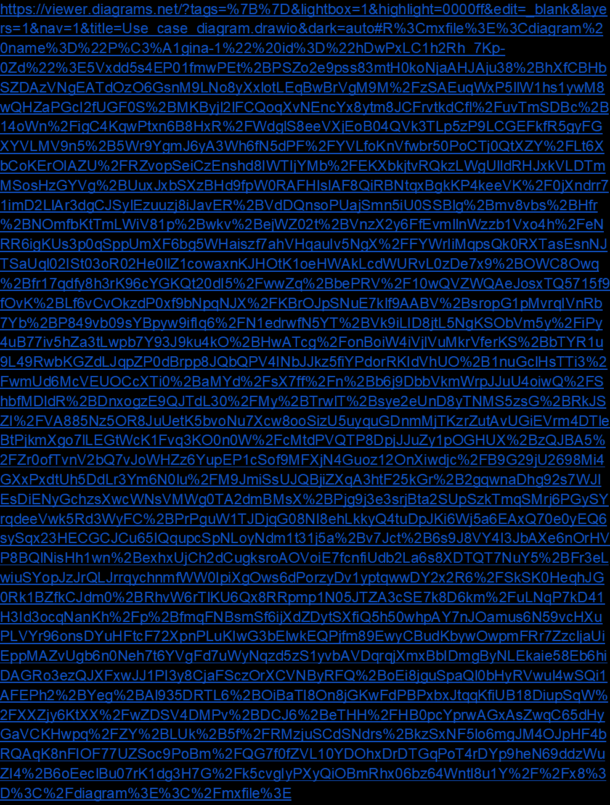

# 🎵 RiwiMusic Console Application

RiwiMusic is a **C# console-based music event management system** that allows users to manage concerts, register clients, sell tickets, and perform advanced queries using **LINQ**.

This project applies **Object-Oriented Programming (OOP)** principles to organize code logically and model real-world entities like concerts, clients, and tickets.

---

## 🔹Use case diagram:
<div style={{
    width: '100%', 
    height: 'auto', 
    display: 'flex', 
    justifyContent: 'center', 
    alignItems: 'center',
    padding: '20px'
}}>
  <iframe 
    src="https://viewer.diagrams.net/?tags=%7B%7D&lightbox=1&highlight=0000ff&edit=_blank&layers=1&nav=1&title=Use_case_diagram.drawio&dark=auto#R%3Cmxfile%3E%3Cdiagram%20name%3D%22P%C3%A1gina-1%22%20id%3D%22hDwPxLC1h2Rh_7Kp-0Zd%22%3E5Vxdd5s4EP01fmwPEt%2BPSZo2e9pss83mtH0koNjaAHJAju38%2BhXfCBHbSZDAzVNgEATdOzO6GsnM9LNo8yXxlotLEqBwBrVgM9M%2FzSAEuqWxP5llW1hs1ywM8wQHZaPGcI2fUGF0S%2BMKByjl2lFCQoqXvNEncYx8ytm8JCFrvtkdCfl%2FuvTmSDBc%2B14oWn%2FigC4KqwPtxn6B8HxR%2FWdglS8eeVXjEoB04QVk3TLp5zP9LCGEFkfR5gyFGXYVLMV9n5%2B5Wr9YgmJ6yA3Wh6fN5dPF%2FYVLfoKnVfwbr50PoCTj0QtXZY%2FLt6XbCoKErOIAZU%2FRZvopSeiCzEnshd8IWTIjYMb%2FEKXbkjtvRQkzLWgUlldRHJxkVLDTmMSosHzGYVg%2BUuxJxbSXzBHd9fpW0RAFHIslAF8QiRBNtqxBgkKP4keeVK%2F0jXndrr71imD2LlAr3dgCJSylEzuuzj8iJavER%2BVdDQnsoPUajSmn5iU0SSBlg%2Bmv8vbs%2BHfr%2BNOmfbKtTmLWiV81p%2Bwkv%2BejWZ02t%2BVnzX2y6FfEvmllnWzzb1Vxo4h%2FeNRR6igKUs3p0qSppUmXF6bg5WHaiszf7ahVHqauIv5NgX%2FFYWrIiMqpsQk0RXTasEsnNJTSaUql02ISt03oR02He0llZ1cowaxnKJHOtK1oeHWAkLcdWURvL0zDe7x9%2BOWC8Owq%2Bfr17qdfy8h3rK96cYGKQt20dI5%2FwwZq%2BbePRV%2F10wQVZWQAeJosxTQ5715f9fOvK%2BLf6vCvOkzdP0xf9bNpqNJX%2FKBrOJpSNuE7klf9AABV%2BsropG1pMvrqIVnRb7Yb%2BP849vb09sYBpyw9ifIq6%2FN1edrwfN5YT%2BVk9iLID8jtL5NgKSObVm5y%2FiPy4uB77iv5hZa3tLwpb7Y93J9ku4kO%2BHwATcg%2FonBoiW4iVjlVuMkrVferKS%2BbTYR1u9L49RwbKGZdLJqpZP0dBrpp8JQbQPV4INbJJkz5fiYPdorRKIdVhUO%2B1nuGclHsTTi3%2FwmUd6McVEUOCcXTi0%2BaMYd%2FsX7ff%2Fn%2Bb6j9DbbVkmWrpJJuU4oiwQ%2FShbfMDldR%2BDnxogzE9QJTdL30%2FMy%2BTrwlT%2Bsye2eUnD8yTNMS5zsG%2BRkJSZI%2FVA885Nz5OR8JuUetK5bvoNu7Xcw8ooSizU5uyquGDnmMjTKzrZutAvUGiEVrm4DTleBtPjkmXgo7lLEGtWcK1Fvq3KO0n0W%2FcMtdPVQTP8DpjJJuZy1pOGHUX%2BzQJBA5%2FZr0ofTvnV2bQ7vJoWHZz6YupEP1cSof9MFXjN4Guoz12OnXiwdjc%2FB9G29jU2698Mi4GXxPxdtUh5DdLr3Ym6N0lu%2FM9JmiSsUJQBjiZXqA3htF25kGr%2B2gqwnaDhg92s7WJIEsDiENyGchzsXwcWNsVMWg0TA2dmBMsX%2BPjg9j3e3srjBta2SUpSzkTmqSMrj6PGySYrqdeeVwk5Rd3WyFC%2BPrPguW1TJDjqG08NI8ehLkkyQ4tuDpJKi6Wj5a6EAxQ70e0yEQ6sySqx23HECGCJCu65IQqupcSpNLoyNdm1t31j5a%2Bv7Jct%2B6s9J8VY4I3JbAXe6nOrHVP8BQlNisHh1wn%2BexhxUjCh2dCugksroAOVoiE7fcnfiUdb2La6s8XDTQT7NuY5%2BFr3eLwiuSYopJzJrQLJrrqychnmfWW0IpiXgOws6dPorzyDv1yptqwwDY2x2R6%2FSkSK0HeqhJG0Rk1BZfkCJdm0%2BRhvW6rTlKU6Qx8RRpmp1N05JTZA3cSE7k8D6km%2FuLNqP7kD41H3Id3ocqNanKh%2Fp%2BfmqFNBsmSf6ijXdZDytSXfiQ5h50whpAY7nJOamus6N59vcHXuPLVYr96onsDYuHFtcF72XpnPLuKIwG3bElwkEQPjfm89EwyCBudKbywOwpmFRr7ZzcljaUiEppMAZvUgb6n0Neh7t6YVgFd7uWyNqzd5zS1yvbAVDqrqjXmxBbIDmgByNLEkaie58Eb6hiDAGRo3ezQJXFxwJJ1PI3y8CjaFSczOrXCVNByRFQ%2BoEi8jguSpaQl0bHyRVwul4wSQi1AFEPh2%2BYeg%2BAl935DRTL6%2BOiBaTI8On8jGKwFdPBPxbxJtqqKfiUB18DiupSqW%2FXXZjy6KtXX%2FwZDSV4DMPv%2BDCJ6%2BeTHH%2FHB0pcYprwAGxAsZwqC65dHyGaVCKHwpq%2FZY%2BLUk%2B5f%2FRMzjuSCdSNdrs%2BkzSxNF5lo6mgJM4OJpHF4bRQAqK8nFIOF77UZSoc9PoBm%2FQG7f0fZVL10YDOhxDrDTGqPoT4rDYp9heN69ddzWuZI4%2B6oEeclBu07rK1dg3H7G%2Fk5cvgIyPXyQiOBmRhx06bz64Wntl8u1Y%2F%2Fx8%3D%3C%2Fdiagram%3E%3C%2Fmxfile%3E"
    title=""
    style={{
        border: '1px solid #ccc',
        borderRadius: '8px',
        boxShadow: '0 4px 8px rgba(0, 0, 0, 0.1)',
        width: '100%',
        maxWidth: '1200px',
        height: '80vh',
        aspectRatio: '16/9'
    }}
    allowFullScreen>
  </iframe>
</div>

## 🔹UML diagram (class diagram)
<div style={{
    width: '100%', 
    height: 'auto', 
    display: 'flex', 
    justifyContent: 'center', 
    alignItems: 'center',
    padding: '20px'
}}>
  <iframe 
    src="https://viewer.diagrams.net/?tags=%7B%7D&lightbox=1&highlight=0000ff&edit=_blank&layers=1&nav=1&title=Classes_diagram.drawio&dark=auto#R%3Cmxfile%3E%3Cdiagram%20name%3D%22P%C3%A1gina-1%22%20id%3D%22hDwPxLC1h2Rh_7Kp-0Zd%22%3E7Zzvc6I4GMf%2FGmfubqYdA6L4sv7Y7c5073rb3nTvZQqp5BqIG%2BKq%2Fes3gUTEQNWuwPZkxpmSxyRCvp88yfMA7djjcPWRwXnwmfqIdKyuv%2BrYk45lAbvfFX%2BkZZ1aBkMnNcwY9lWlzHCHX1BqHCrjAvsoztXjlBKO53mjR6MIeTxng4zRZb7aEyX5H53DGTIMdx4kpvUB%2BzxIra41yOzXCM8C%2Fcugr048hLqyGoA4gD5dbpnsacceM0p5ehSuxojIsdPDkrb7UPLt5sQYivghDW6%2FsQW%2FGQx97293sB49%2FuOC0YVl99XZ8bW%2BZOSLEVBFynhAZzSCZJpZR4wuIh%2FJfruilNW5oXQujEAY%2F0Ocr5WacMGpMAU8JOpbtML869bxv7KrS0eVJivVc1JY60LE2frrdmGrlSxmzZKSbhdzyPiVREEYpl9CGPl%2FRUh%2F8QETsmnm56qtU9tWDXPIlQpyyLYMSoCPiIZInIqowBCBHH%2FPQwUVm7NNvU3TW4rFT1hdNY1soCaNmkSWY%2BW7EJcyQ1y1yiAQB1unkZkSNI7CBDSCiZYc1CS5qvaLqD7QrkOp3t%2FtonLV7UZVP8OJ7vTykvdAL99FTBfMQxVK3ntPku9X8mAoGpPcAv285G63Zsmd9%2BTb%2Fw%2BS785yAAZVSe7CwcX0ZTS79kbBw8PsG3Wvri%2BA8uvfIVmoaxjTyEOMGyTESxwSmAzfE424hkKKBgmeReLYE8OHmDB8Fx1gsXW%2BUl9wicLICzDxb%2BCaLuQgCw28Z10aBZThF9Et1FQkEilmrH6uxp1sqZRjKBZ1brVyYMf0Ga5yFW9gzJXBo4TAeYwfN5cRikUURyPKOQ1VpWWAObqbQ0%2FWWYq4Jo9uKTdyANDqVXL0hi4%2F53VxmYUYoKc8cbAdXgy75azlKDkaiZ6BRMcSV9r9NOnYV7J1ZMIhLpYnojH6jMaUUEHBJKIpLWKe7Zg0MAQ98VJcYjHsOJrdJHUmvczyRQ2DNFHR9okkEzzAvo%2BixCNxyGGqqxRxLmdPMkzOSHzEwI2ld3HEiY9FGWRl8ZHVGReTQFwLxImsSECzRBKc43l4fdbtp0Rv8w%2FEQtc7ORV6A2pQ8ScMUcqFGDAhTotGzWjoALAxNMCwBI0x5usWjQbRGLhNo%2BGWoDGBXHkNeXSPhQ9p4agXDtDtNU3HoISOezHaZAylNNqDtJuOBgixu00T4hQQskMBwSqkkxTozDx4EwKhEDOJaZXm90kEewEMLmyTC7uAAQIfEbmlMeaYyv5ZWneHjX3y5%2FnGUYAY5pXq7hy423Srkr1f4hjuArr8FD1Rcfjb760%2FqNsf9JteMfT0305XEIwK1oY2W1FJtqLfU3P%2B2HSFXZWvsMwMVpuuOK2n2My6d5SuKEtitemKhtFoPF1hFe0pJRrTEGLSstEgG43nK6yifEUbbxwVbxwv%2B8GZiMr2EGUZzDbeaNIdAND0WmGbdz3usfeM2nijrrujeiP3Sryhn5LIxRs6VD09EsBAoo03TuspNrPup%2BKNIiyqcxRlGSv1NEULR3NwFEUc9cJRdp8jzV21bDTHRlHEUS8bZekreU%2F0dsG8AMaovVPaKCSF8Um9lBSls9q49Ki49A26F93%2FLNK9qrjULktVtXFpo%2F7AbnrVcMzpX8OD2qXxXPqQ8ivnqx8RS19TOWCrdLrnrn9unM3V2Xz9SU23rYHaG%2FFvHGwSd5fODjkBpAxxqgg4YlKXanV47L1BWmE%2FHBrU65cfc9APqhLDXATF5uhs5LAsZ58cPadOOczFCVxe%2FnE%2BerjuPj10VqAePRp5f%2Ffta4LO7O1fE%2Fq%2F1ppgRvPnsyZsXjzV8bOZW6l3TTBv2J2VE3K6vX161OuEzDtpj4v1%2BSzSjuPu0%2BNEi7QoZv8xIn0dMPu3G%2Fb0Bw%3D%3D%3C%2Fdiagram%3E%3C%2Fmxfile%3E"
    title=""
    style={{
        border: '1px solid #ccc',
        borderRadius: '8px',
        boxShadow: '0 4px 8px rgba(0, 0, 0, 0.1)',
        width: '100%',
        maxWidth: '1200px',
        height: '80vh',
        aspectRatio: '16/9'
    }}
    allowFullScreen>
  </iframe>
</div>
## 📂 Project Structure

---

## ⚙️ Installation & Setup

### 🔹 Requirements
- [.NET SDK](https://dotnet.microsoft.com/download) (version 6.0 or higher recommended)
- A terminal or IDE (Visual Studio, Rider, VS Code with C# extension)

### 🔹 Clone the Repository
```bash
git clone https://github.com/Voyager-team-BJ/Sprint-1-activity-5.git
cd riwi-music
dotnet run
```

---

# 🚀 Features

✅ Manage Concerts (Create, List, Update, Delete, View details)  
✅ Manage Clients (Register, Edit, Delete, List)  
✅ Manage Tickets (Sell, List, Edit, Delete)  
✅ Purchase History per Client  
✅ Advanced Queries using LINQ:
- Concerts by city
- Concerts by date range
- Client with most purchases
- Most popular concert

---

# 🖥️ Usage Flow

When you run the program, you’ll see a main menu with options:

- Manage Concerts 🎤
- Manage Clients 👤
- Manage Tickets 🎟️
- Purchase History 📜
- Advanced Queries 🔍

Follow the menu prompts to navigate through different modules.

### Example workflow:
- Add a new concert
- Register a client
- Sell a ticket for the client to attend the concert
- View purchase history and run LINQ queries

---

# 🧑‍💻 OOP Justification in RiwiMusic

For the RiwiMusic project, we applied **Object-Oriented Programming (OOP)** to structure the code in a more logical and real-world manner.

### Identifying Entities as Classes
- Main entities: **Concert**, **Client**, and **Ticket**.
- Each class acts as a blueprint grouping attributes and behaviors.
- The **Ticket** class is crucial because it links a **Client** with a **Concert** via their IDs.

### Encapsulation
- A central class **RiwiMusicSystem** stores all data collections (concerts, clients, tickets) as **private lists**.
- Only **public methods** (e.g., `RegisterClient()`) can modify them.
- This ensures **security and organization**, hiding internal complexity.

### Abstraction
- The **Program.cs** file remains clean and only calls methods from `RiwiMusicSystem`.
- The internal business logic is abstracted away from the main entry point.

### Future Extensibility (Polymorphism & Inheritance)
- While inheritance wasn’t necessary in this version, polymorphism could easily be applied in the future (e.g., different ticket types such as **VIP** or **General** with different rules).

📌 **In summary:**  
OOP allowed us to divide the project into clear modules, making the system organized, secure, and collaborative-friendly.

---

# 🛠️ Technologies Used

- **C# 10 / .NET 8.0**
- **LINQ** for advanced queries
- **Console-based UI**

---

# 🤝 Contributing

1. Fork the project
2. Create a new feature branch (`git checkout -b feature/new-feature`)
3. Commit your changes (`git commit -m 'Add new feature'`)
4. Push the branch (`git push origin feature/new-feature`)
5. Open a Pull Request 🎉

---

# 📜 License

This project is licensed under the **MIT License**. You are free to use, modify, and distribute it.

---

# ✨ Author

Developed with ❤️ by **Juan David Barrera and Brahiam Ruiz Alzate**
